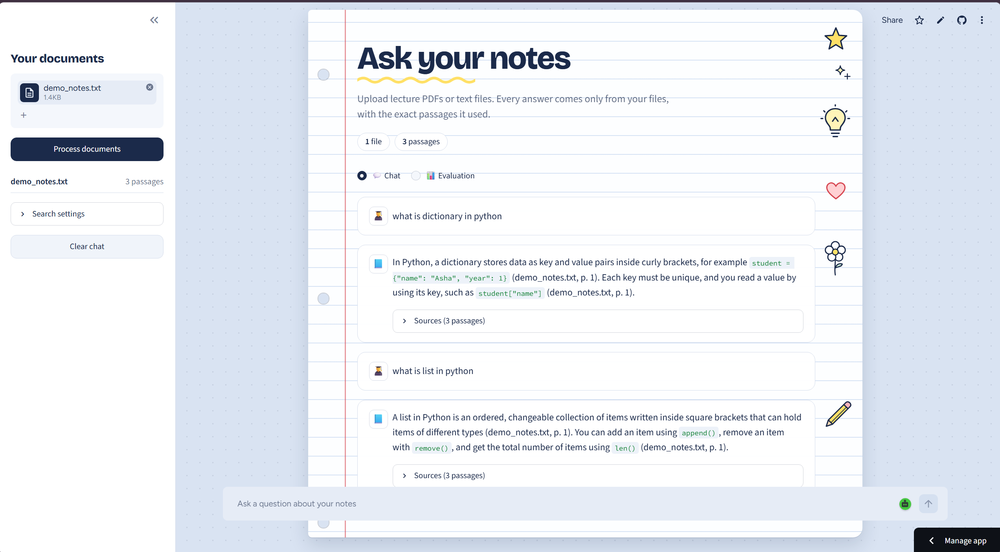
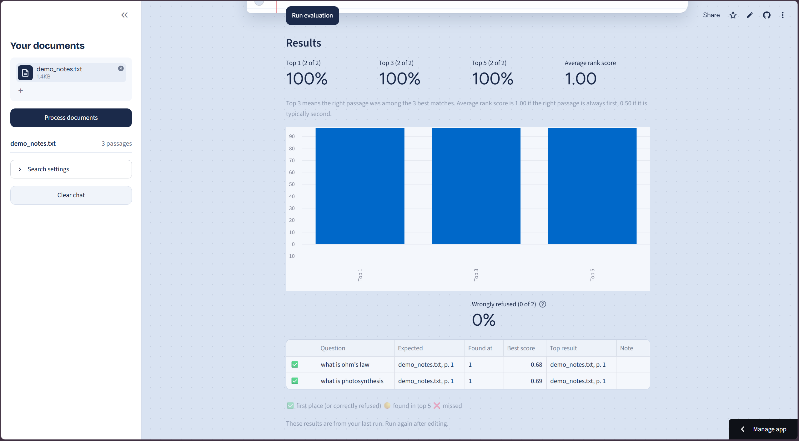

# Smart Document Knowledge Assistant

Upload lecture PDFs or text files, ask questions in a chat, and get answers taken **only from your files**, with the exact passages and page numbers shown so you can check them.

Built for the Nexus VIT Chennai Technical Recruitment 2026 (Problem 02).

**Live demo:** [https://smart-document-assistant-tvqgz6fl2j8fyuj4zkvvkw.streamlit.app/]



## What it does

- Upload one or many `.pdf` and `.txt` files
- Ask questions in a chat, including follow-ups such as "what about its units?"
- Every answer shows the source passages, with file name, page number and a similarity score
- If the answer is not in your documents, the app says so instead of guessing
- An Evaluation tab measures how often the search finds the right passage

## How it works

This is a Retrieval-Augmented Generation (RAG) pipeline:

1. **Read**: text is extracted from each file page by page (PyMuPDF), so every piece keeps its file name and page number.
2. **Chunk**: each page is split into overlapping passages of about 800 characters.
3. **Embed**: every passage is turned into a vector with Gemini's `gemini-embedding-001` model and stored in a numpy table.
4. **Search**: the question is embedded the same way, and the closest passages are found by cosine similarity.
5. **Refuse or answer**: if the best match is below a relevance threshold, the app says the answer is not in the documents. Otherwise the top passages are sent to a Gemini model with the instruction to answer using only that context.
6. **Follow-ups**: before searching, the chat history is used to rewrite a follow-up into a full standalone question.

## Evaluation

The Evaluation tab runs your own test questions through the search and reports how often the correct passage is found.

| Measure | Result |
|---|---|
| Test questions | [2] |
| Right passage in top 1 | [100]% |
| Right passage in top 3 | [100]% |
| Right passage in top 5 | [100]% |
| Questions not in the notes correctly refused | [0] of [2] |

Chunk size comparison (same questions, different split sizes):

| Chunk size | Top 1 | Top 3 |
|---|---|---|
| 500 | [100]% | [100]% |
| 800 | [100]% | [100]% |
| 1200 | [100]% | [100]% |



## Tech stack

Python, Streamlit, PyMuPDF, Google Gemini API (answer generation and embeddings), numpy, pandas.

## Run it locally

1. Install Python 3.12 and clone this repository.
2. Create and activate a virtual environment:

   ```
   python -m venv venv
   venv\Scripts\activate
   ```

3. Install the requirements:

   ```
   pip install -r requirements.txt
   ```

4. Get a free API key from [Google AI Studio](https://aistudio.google.com) and create a file named `.env` in the project folder:

   ```
   GEMINI_API_KEY=your_key_here
   ```

5. Start the app:

   ```
   streamlit run app.py
   ```

6. Upload a file from `sample_docs/`, click **Process documents**, and ask a question.

## Project structure

```
app.py          Streamlit interface (chat view and evaluation view)
ingest.py       Reads PDF/TXT files and splits them into chunks
retrieval.py    Embeddings and similarity search
llm.py          Gemini calls: answering, follow-up rewriting, test-question suggestions
evaluate.py     Scoring logic for the evaluation tab
eval_ui.py      Evaluation tab interface
ui.py           Styling (notebook theme)
sample_docs/    Files to try the app with
```

## Limitations

- Scanned PDFs (images of text) cannot be read, because there is no OCR step.
- Embeddings and answers use the Gemini API, so the app needs internet and is subject to free-tier rate limits.
- Answer quality depends on the retrieved passages; the Evaluation tab shows where the search misses.

## Ideas for the future

- Hybrid search (keyword plus meaning-based) and a side-by-side comparison with Ctrl+F
- OCR for scanned PDFs
- A study mode that makes quiz questions from the uploaded notes
